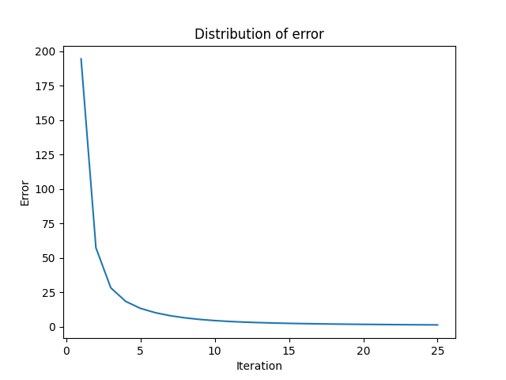
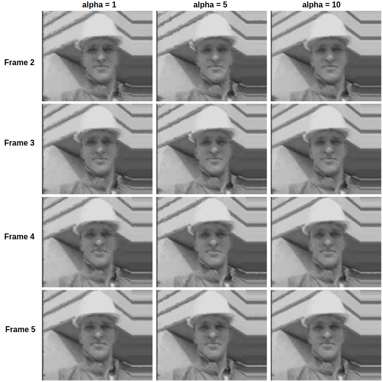

This repository provides an implementation of the Horn and Schunck Optical Flow algorithm for motion estimation. The data is a video with the format ".avi" and can be found in the data folder. 
## **Usage**
```sh
$ python optical_flow.py </data/path>
```
## **Report**
The project report can be found in the "ProjectReport" folder.
## **Results** 
To estimate the optical flow vectors, the experiments are conducted with different smoothness parameters and error functions are reported. 
### **α** = 0

### **α** = 1

### **α** = 10


The estimated frames are reported with different smoothness parameters. 




## **Credits**
Utilized from "Video-Interpolation-using-Optical-Flow" by Vineeth S. (vineeths96@github) for estimation using the optical flow vectors.
