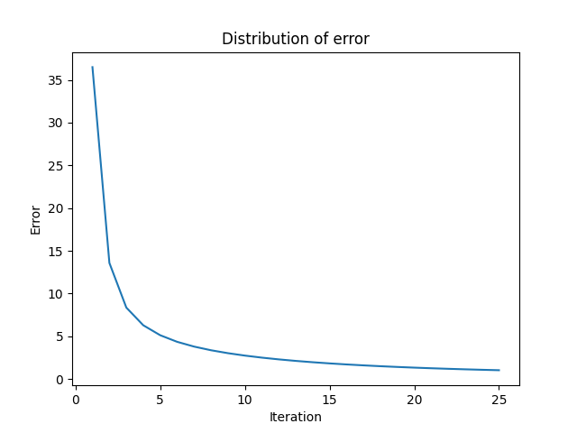
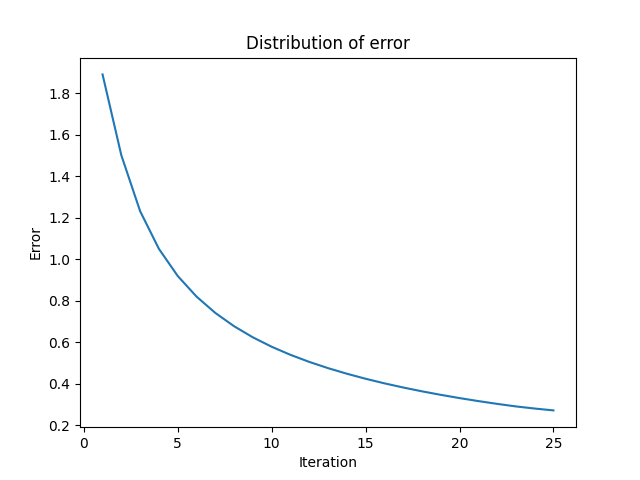
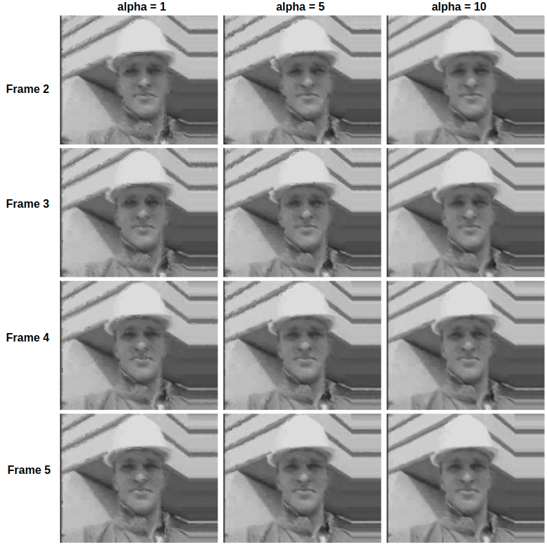

# MotionEstimation-HornSchunckOpticalFlow

This reprository provides an implementation of Horn and Schunck Optical Flow algorithm for motion estimation. The data is a video with format ".avi" and can be found in data folder. 
## **Usage**
```sh
python optical_flow.py </data/path>
```
## **Report**
This project report is can be found in "ProjectReport" folder.
# **Results** 
To estimate the optical flow vectors, the experiments are conducted with different smoothness parameters and error functions are reported. 
### **α** = 0

### **α** = 1

### **α** = 10



The estimated frames are reported with different smoothness parameters. 

